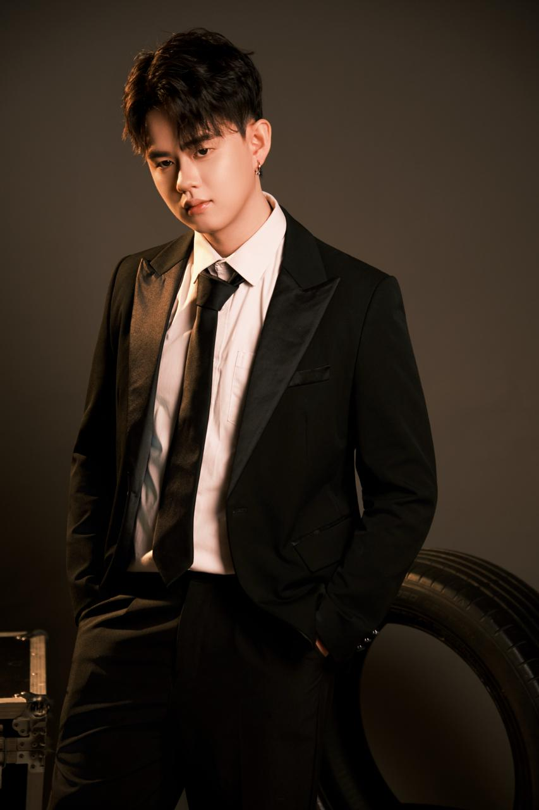

# Wong Wei Ming

{ align=left width="150" }

**Computer Engineering @ NTU | Exploring ==Embodied AI & Spatial Intelligence==**

I am building at the intersection of AI and physical interaction. My goal is to develop machines that truly understand and navigate the physical world through Embodied AI. I focus on bridging high-level reasoning with real-world robotic execution.

[:fontawesome-brands-linkedin: LinkedIn](https://www.linkedin.com/in/wongweiming){ .md-button .md-button--primary }
[:fontawesome-brands-github: GitHub](https://github.com/Alvin0523){ .md-button }

---

## Technical Arsenal

-   :material-brain:{ .lg .middle } __Intelligence__

    ---

    Vision-Language Models (VLM) · Vision-Language-Action (VLA) · Deep Learning

-   :material-robot:{ .lg .middle } __Robotics & Perception__

    ---

    SLAM · Nav2 · NVIDIA Isaac ROS · ROS / ROS 2

---

## Key Achievements

!!! success "Competition Achievements"
    
    :trophy: **Champion** – Singapore AUV Challenge (SAUVC) 2025  
    :medal: **Top 10 & Best New All-Rounder** – RoboNation RoboSub 2025
    :dart: **Finalist** – NTU Escendo @ Garage EEE 2025

---

## Education

???+ info "Nanyang Technological University Singapore"
    **Bachelor of Engineering (Honours)**  
    Computer Engineering & Data Analytics (Minor in Entrepreneurship)  
    *2023 - May 2027*
    
    - NTU President Research Scholar (URECA)
    - CCDS & COE (Mecatron) & NTUpreneur Student Ambassador
    - Chief Programmer — CCDS Orientation AY25/26

??? info "The Hong Kong University of Science and Technology"
    **Bachelor of Engineering**  
    Computer Engineering  
    *Jan 2026 - May 2026* (Exchange)

---

!!! note "Open to Work"
    I'm currently open to opportunities in:
    
    - Machine Learning Engineer
    - Artificial Intelligence Engineer
    - Deep Learning Engineer
    - Computer Vision Research Engineer
